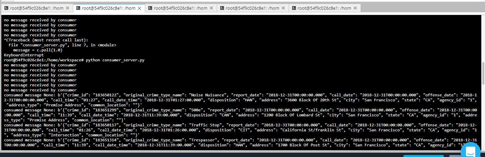

# Udacity Spark Streaming Project (SF-crime-statistics)

In this project, we have been provided  with a real-world dataset, extracted from Kaggle, on San Francisco crime incidents, and we have performed  a statistical analyses of the data using Apache Spark Structured Streaming. We had to  draw on the skills and knowledge we've learned in this course to create a Kafka server to produce data, and ingest data through Spark Structured Streaming.

# Step 1
The first step is to build a simple Kafka server. Complete the code for the server in producer_server.py and kafka_server.py.

