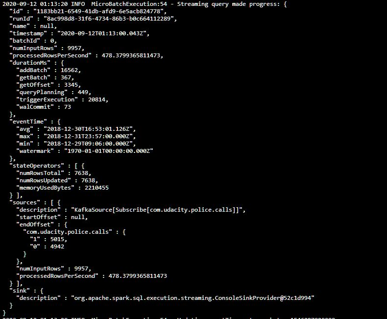
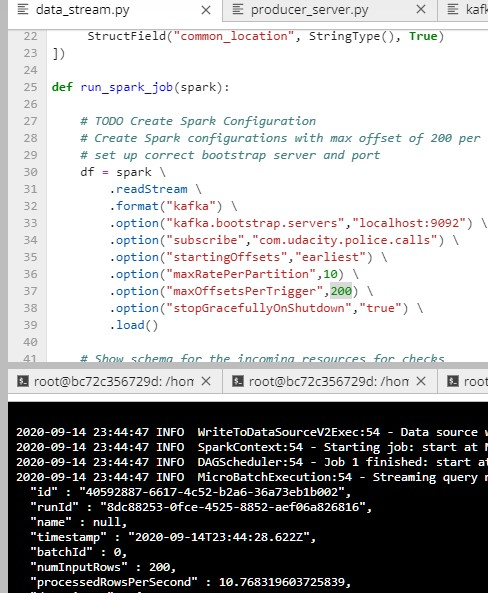
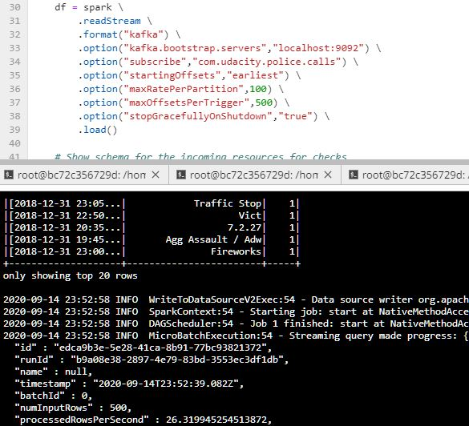
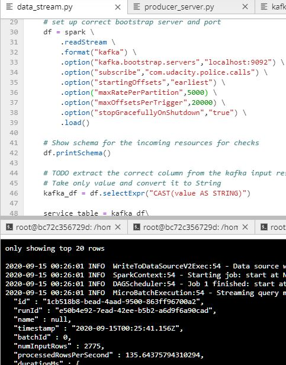

# Udacity Spark Streaming Project (SF-crime-statistics)

In this project, we have been provided  with a real-world dataset, extracted from Kaggle, on San Francisco crime incidents, and we have performed  a statistical analyses of the data using Apache Spark Structured Streaming. We had to  draw on the skills and knowledge we've learned in this course to create a Kafka server to produce data, and ingest data through Spark Structured Streaming.

## Step 1
The first step is to build a simple Kafka server. Complete the code for the server in producer_server.py and kafka_server.py.

## Step 2
* Apache Spark already has an integration with Kafka brokers, so we would not normally need a separate Kafka consumer. However, we are going to ask you to create one anyway. Why? We'd like you to create the consumer to demonstrate your understanding of creating a complete Kafka Module (producer and consumer) from scratch. In production, you might have to create a dummy producer or consumer to just test out your theory and this will be great practice for that.

* Implement all the TODO items in data_stream.py. You may need to explore the dataset beforehand using a Jupyter Notebook.

* Do a spark-submit using this command: spark-submit --packages org.apache.spark:spark-sql-kafka-0-10_2.11:2.3.4 --master local[*] data_stream.py

Progress Reporter:

Spark Streaming UI:

Results:

## Step 3

* How did changing values on the SparkSession property parameters affect the throughput and latency of the data?

    There are a couple of important parameters that we can modify to affect the behavior:
    * maxOffsetsPerTrigger: Rate limit on maximum number of offsets processed per trigger interval. The specified total number of offsets will be proportionally split across topicPartitions of different volume. [Apache spark docs](https://spark.apache.org/docs/2.1.0/structured-streaming-kafka-integration.html)

     * maxRatePerPartition: is the maximum rate (in messages per second) at which each Kafka partition will be read by this direct API. [Apache spark docs](https://spark.apache.org/docs/2.1.0/structured-streaming-kafka-integration.html)
 
     * Local[K]: Run Spark locally with K worker threads (ideally, set this to the number of cores on your machine). [Apache spark docs](https://spark.apache.org/docs/2.1.0/structured-streaming-kafka-integration.html)
     
    if I change these parameters and increse their values I can see an increment on the processedRowsPerSec(with local[*] to use all threads): 
    
    
    
    
    
    
    

* What were the 2-3 most efficient SparkSession property key/value pairs? Through testing multiple variations on values, how can you tell these were the most optimal?

    I achieved the best performance with the following configuration: 
       * maxRatePerPartition: 5000
       * Local[*] 
       * maxOffsetsPerTrigger:20000

     
